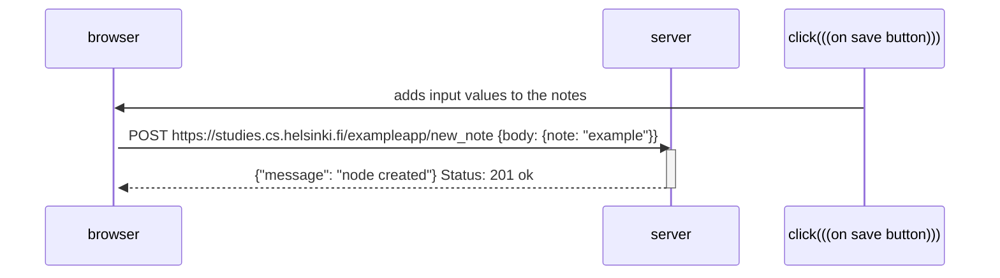

##Flow Chart

```mermaid
    sequenceDiagram
    participant browser
    participant server

    click(((on save button))) ->> browser: adds input values to the notes
    activate browser


    browser->>server: POST https://studies.cs.helsinki.fi/exampleapp/new_note {body: {note: "example"}}
    activate server
    server-->>browser:  {"message": "node created"} Status: 201 ok
    deactivate server

```